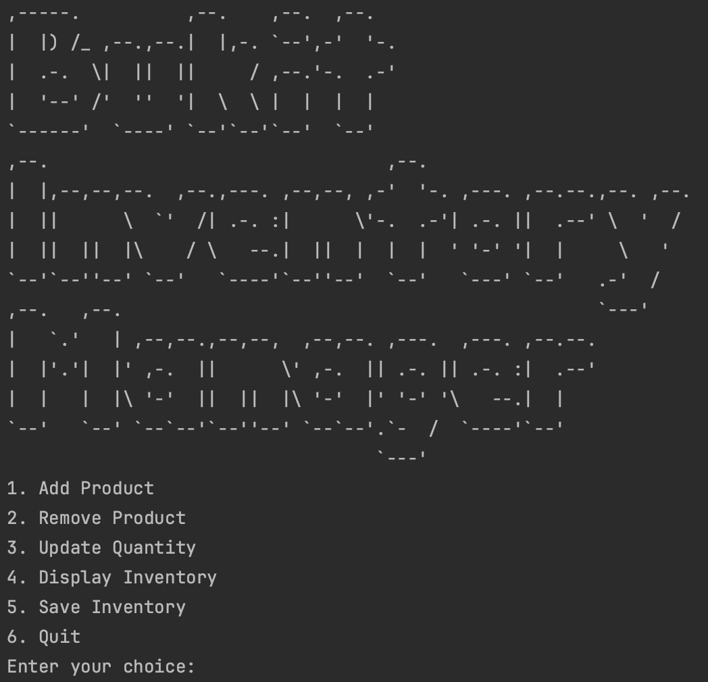
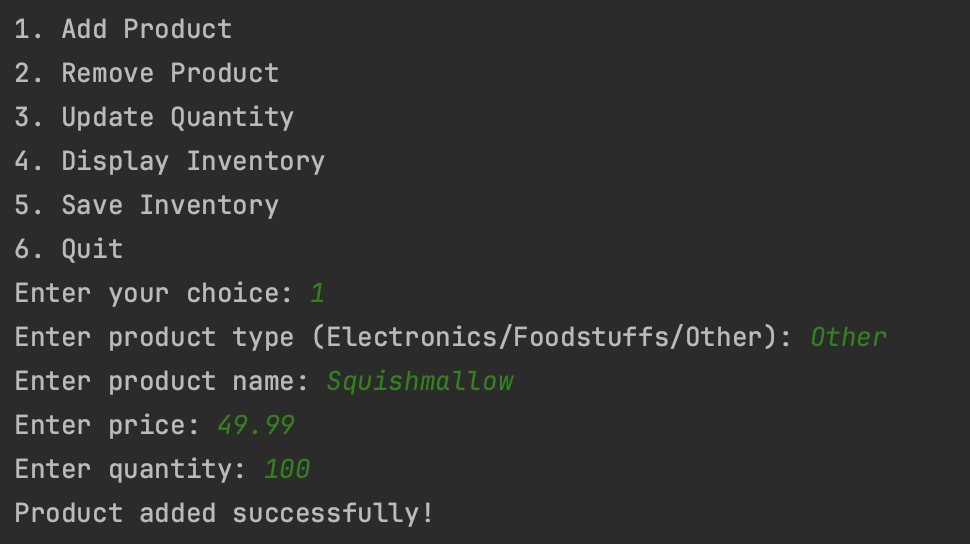
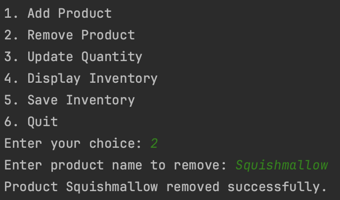
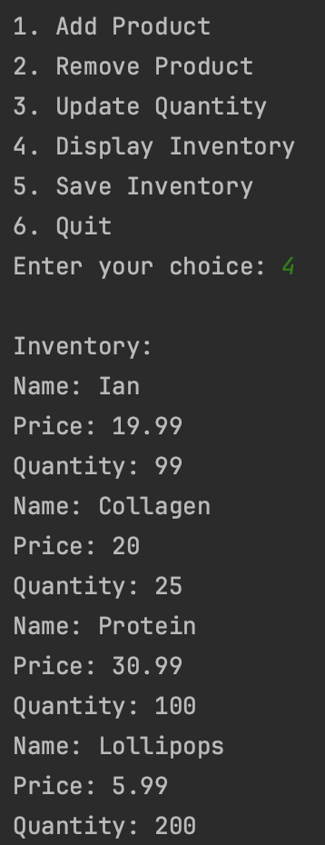

# Bukit-Inventory-Manager
File I/O based inventory management system

## Summary
This project uses user input, file I/O, and inheritance principles to allow the filling, emptying, and editing the contents of a working Inventory Management System. There are five features available to the user, including Add, Remove, and Update products, as well as displaying and saving the inventory.

## Screens
### menu

### add/remove/display

## Languages Used
C++

## Installation
To run this program, all that is required is
- C++ Compiler that supports C++ 11 or later (I use CLion)

## How to Run
1. Clone this repository into your compiler
2. Enter the project directory
3. Compile & run the code with your compiler

## Controls
The user should enter information when prompted by the system.
- initially, user will enter an integer 1-6 depending on their choice
- the system will prompt the user to enter more information (all input is validated)
- provided that the user selects the 'save inventory' option, all information can be displayed/updated even after stopping and running the program again

## Credits & Contact
All code and files were written by me.

Chase Melisky - [Linkedin](https://www.linkedin.com/in/chase-melisky/) | [Github](https://github.com/cmelisky) | [Email](mailto:cmelisky@uvm.edu)
